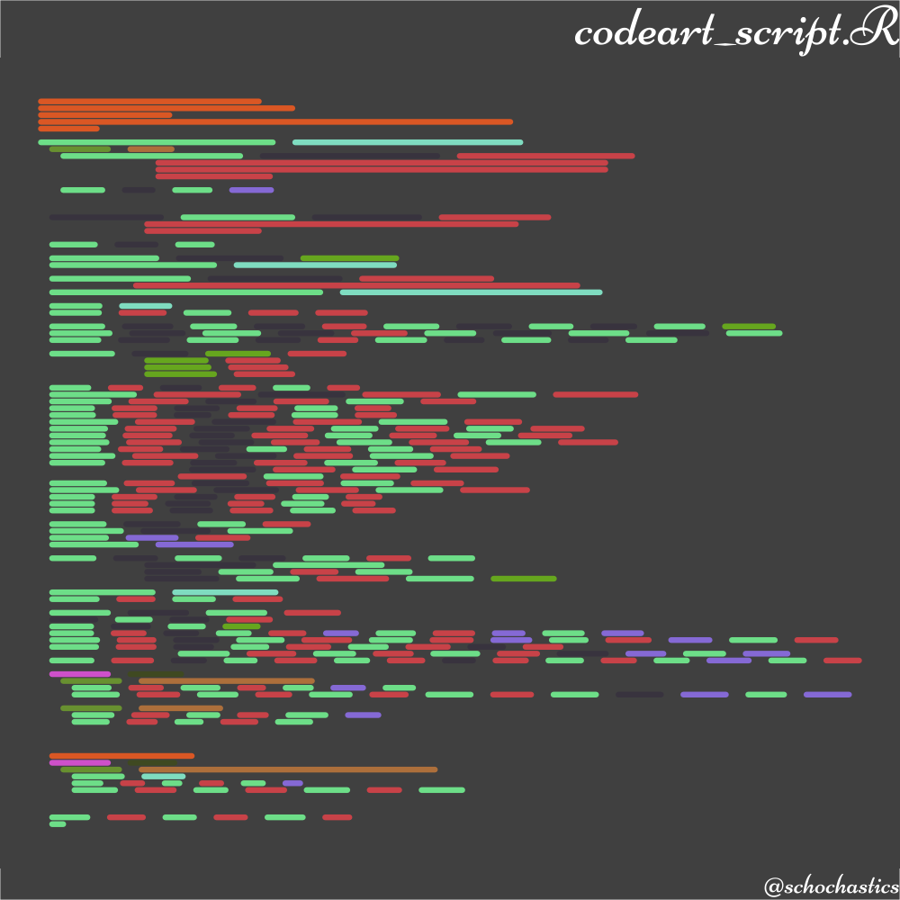

<!-- README.md is generated from README.Rmd. Please edit that file -->

```{r, include = FALSE}
knitr::opts_chunk$set(
  collapse = TRUE,
  comment = "#>",
  fig.path = "man/figures/README-",
  out.width = "100%"
)
```

# codeart

<!-- badges: start -->
[](https://www.tidyverse.org/lifecycle/#experimental)
<!-- badges: end -->

This package is inspired by the generative art of [Eric Davidson](https://github.com/erdavids/Simulated-Code)

## Installation

You can install the released version of codeart from GitHub with:

``` {r install, eval=FALSE}
remotes::install_github("schochastics/codeart")
```

## Examples

The code below shows how to transform an existing R script into "abstract art".

```{r example_script, eval=FALSE}
library(codeart)
library(showtext)

font_add_google("Niconne", "niconne")
showtext_auto()

dat <- codeart_script("R/codeart_script.R")
plot_codeart_script(dat,font = "niconne",title = "codeart_script.R",caption = "@schochastics")

```




You can also generate random art with the package.
```{r example_random,fig.height=7,warning=FALSE}
library(codeart)
dat <- codeart_random()
plot_codeart_rand(dat)

```

